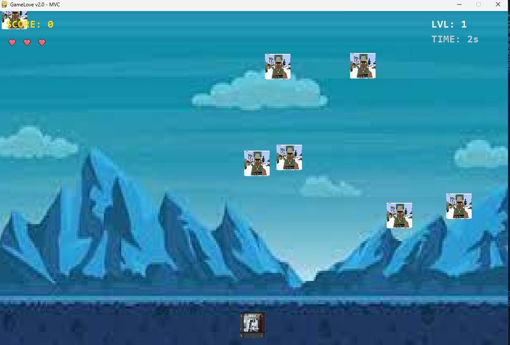

# GameLove ❤️ 

**GameLove** es un videojuego de estilo arcade desarrollado en Python utilizando la librería **Pygame**. El proyecto aplica el patrón de diseño arquitectónico **Modelo-Vista-Controlador (MVC)** para garantizar la escalabilidad y el mantenimiento del código.

## 📸 Vista Previa del Sistema

Aquí puedes observar la interfaz principal y el flujo del juego:

<p align="center">
  
  <br>
  <i>Interfaz del menú principal del juego: Visualización (Nivel, Tiempo, Record).</i>
</p>

<p align="center">
  
  <br>
  <i>Interfaz de juego: Visualización de HUD (Nivel, Tiempo, Record) y Sistema de Vidas.</i>
</p>


## 🚀 Características y Funcionalidades
- **Arquitectura MVC:** Separación clara entre la lógica de datos (Model), la interfaz de usuario (View) y el flujo de control (Controller).
- **Dificultad Progresiva:** El sistema escala el nivel de los enemigos y su velocidad automáticamente cada 20 segundos de supervivencia.
- **Persistencia de Datos:** Sistema de guardado local para el récord máximo (Nivel y Tiempo de supervivencia).
- **Menú de Configuración:** Interfaz de inicio con selector de dificultad (Fácil, Normal, Difícil) antes de comenzar la partida.
- **Gestión de Recursos:** Uso eficiente de `pygame.sprite.Group` para el manejo de colisiones y optimización de memoria (limpieza de objetos fuera de pantalla).

## 🛠️ Tecnologías Utilizadas
- **Lenguaje:** Python 3.12+
- **Librería:** Pygame
- **Patrón de Diseño:** Model-View-Controller (MVC)
- **Persistencia:** Manejo de archivos planos (.txt)

## 🎮 Instrucciones de Instalación

1. Clonar el repositorio.

2. Crear un entorno virtual:

    python -m venv venv


3. Activar el entorno virtual:

    Windows: .\venv\Scripts\activate

4. Instalar dependencias:

    pip install -r requirements.txt

5. Ejecutar el juego:

    python main.py

✒️ Autor

Emanuel - Estudiante de Ingeniería de Sistemas e Informática.

## 📁 Estructura del Proyecto
```text
GameLove/
├── assets/images/    # Sprites y fondos del juego
├── data/             # Archivos de persistencia (Récord)
├── src/              # Código fuente modular (Model, View, Sprites)
└── main.py           # Punto de entrada del videojuego


